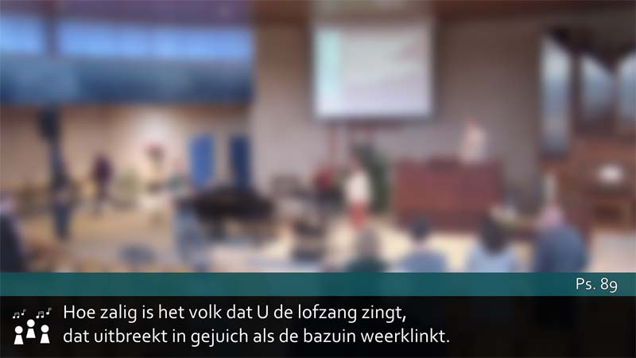
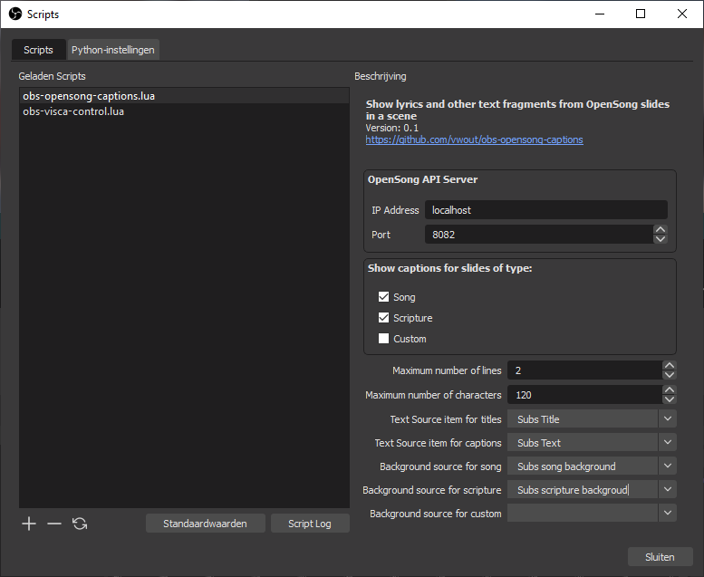

# obs-opensong-captions
A plugin for [OBS](https://obsproject.com/) to show lyrics and other fragments from [OpenSong](https://opensong.org/) slides as captions.

This Lua script plugin connects OBS to OpenSong.
It supports visualization of lyrics and texts from OpenSong slides in an OBS scene as low third caption using a (GDI) text element.
A portion of the text, limited by either a maximum number of lines, or a maximum number of characters is shown at a time.
Traversal to subsequent or previous portions is done using shortcut keys. See below for an example:

This example uses a (partially)transparent image that is used as background for the low third.
On top of this background, to text items are placed, one for a title can one for the captions. 

## How it works
The OBS plugin connects to OpenSong via the [websocket API](http://www.opensong.org/home/api) of OpenSong.
Via this API, the plugin is notified upon a transition to a new slide.
When the slide is of type song, scripture or custom, the text is extracted and split into sets of lines for display in a lower third as caption.
The plugin does not render the text itself, but relies on (GDI) text elements in OBS.  

# Installation
The plugin is a script plugin and utilizes the Lua scripting capabilities of OBS.
To use the plugin, add the file `obs-opensong-captions.lua` to OBS under *Script* in the *Tools* menu.
The other `.lua` files and the directory `websocket` in this repository are also required, but should not be added as scripts in OBS.

# Configuration
## Connection to OpenSong
To use the plugin, it must be configured in the Script dialog.
 
The plugin need to be configured in order to connect to OpenSong and to have the text rendered using the correct items.
The OpenSong host name or ip-address and the port at which the OpenSong API is running need to be provided.
The plugin by default process song and scripture slides, but custom slides can also be processed when the corresponding box is ticked.
In the dropdown lists, the text sources need to be selected in which the slide title and text-fragments need to be rendered.
When applicable, a backgrounds can be assigned. The sources selected using the dropdowns for backgrounds will be used to show or hide the respective sources in correspondence with the associated type of OpenSong slide.
This way, a background can be chosen that is specific for one or more slide styles.

## Shortcut keys
The plugin splits songs and scriptures that are bigger than the limits configured in the plugin for maximum amount of lines or characters. To traverse parts of texts that are split, shortcuts need to be used.
After loading of the plugin, shortcut entries are added to the standard OBS shortcut configuration screen under `Settings`.

# Credits
This plugin uses a number of libraries:
- [luajitsocket](https://github.com/CapsAdmin/luajitsocket/), a library that implements socket support for LuaJIT, since the Lua socket library is not available in OBS.
- a modified version of [lua-resty-websocket](https://github.com/openresty/lua-resty-websocket); only the client of this library is used, without the dependency on ngx_lua, ported to use `luajitsocket`. 
